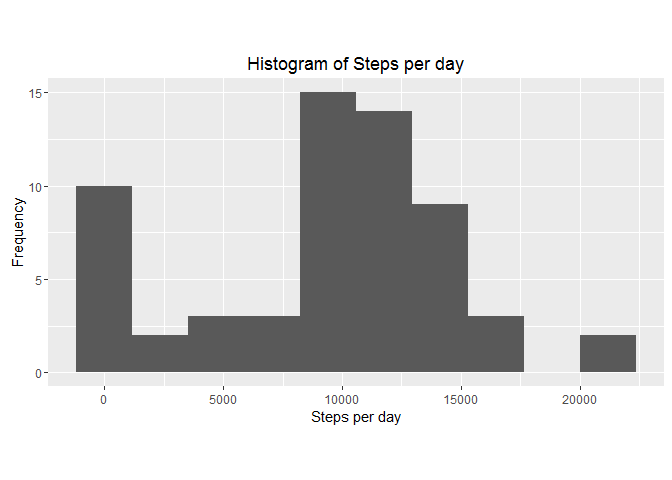
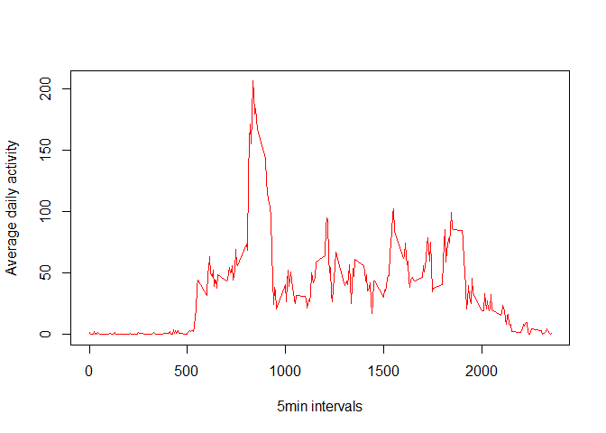
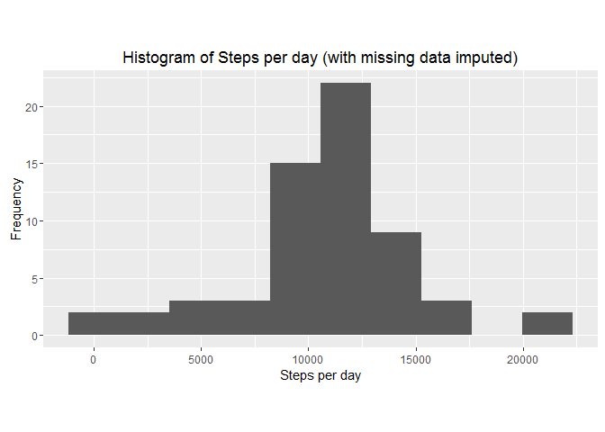

# Reproducible Research: Peer Assessment 1


## Loading and preprocessing the data

Clear the environment to ensure that everything is defined and set the working
directory.


```r
rm(list=ls(all=TRUE))
setwd(paste0(COURSERADIR, "./05 - Reproducible Research/Quizes and Assigments"))
```

Download and unzip the data.


```r
url <- "https://d396qusza40orc.cloudfront.net/repdata%2Fdata%2Factivity.zip" 
file <- "Dataset.zip"
folder <- "Activity Dataset"
if(!file.exists(file)){ download.file(url, file)} 
if(!file.exists(folder)){ unzip(file, list = FALSE, overwrite = TRUE)} 
```

Load the Activity data and the first lines and summaries the dataset.


```r
data <- read.csv("activity.csv")
head(data)
```

```
##   steps       date interval
## 1    NA 2012-10-01        0
## 2    NA 2012-10-01        5
## 3    NA 2012-10-01       10
## 4    NA 2012-10-01       15
## 5    NA 2012-10-01       20
## 6    NA 2012-10-01       25
```

```r
str(data)
```

```
## 'data.frame':	17568 obs. of  3 variables:
##  $ steps   : int  NA NA NA NA NA NA NA NA NA NA ...
##  $ date    : Factor w/ 61 levels "2012-10-01","2012-10-02",..: 1 1 1 1 1 1 1 1 1 1 ...
##  $ interval: int  0 5 10 15 20 25 30 35 40 45 ...
```


## What is mean total number of steps taken per day?

We first sum how many steps are done in each day.


```r
StepsPerDay <- tapply(data$steps,data$date,sum,na.rm=TRUE)
```

Then, we can plot the histogram using the `ggplot2` library to make fancier plots.


```r
library(ggplot2)
```

```
## Warning: package 'ggplot2' was built under R version 3.2.5
```

```r
qplot(StepsPerDay, bins=10, asp = 0.5)+
  labs(title = "Histogram of Steps per day", x = "Steps per day", y = "Frequency")
```

<!-- -->

And calculate the mean and median of the variable `StepsPerDay`.


```r
MyMean <- format(round(mean(StepsPerDay, na.rm = TRUE), 2), nsmall = 2)
MyMedian <- median(StepsPerDay, na.rm = TRUE)
```

The mean is 9354.23 and the median is 10395.


## What is the average daily activity pattern?

We create a new dataframe with the daily activity pattern.


```r
MyAverage <- tapply(data$steps, data$interval, mean, na.rm=TRUE, simplify=T)
MyAverage_df <- data.frame(interval=as.integer(names(MyAverage)), avg=MyAverage)
```

And the time series plot.


```r
with(MyAverage_df,
     plot(interval, avg, type="l",col = "red",
          xlab="5min intervals",
          ylab="Average daily activity"))
```

<!-- -->

Next is to check which 5-minute interval, on average across all the days in the dataset, contains the maximum number of steps:


```r
MyAverage_df[which.max(MyAverage_df$avg),]
```

```
##     interval      avg
## 835      835 206.1698
```


## Imputing missing values

The total number of missing values in the dataset is 2304.


```r
sum(is.na(data$steps))
```

```
## [1] 2304
```

We create a new data frame df_impute that is equal to the original dataset but with the missing data filled in (using mean for that interval for imputation):


```r
NAsdata <- data
NAs <- is.na(NAsdata$steps)
AvgInterval <- tapply(data$steps, data$interval, mean, na.rm=TRUE, simplify=T)
NAsdata$steps[NAs] <- AvgInterval[as.character(NAsdata$interval[NAs])]
```

Make a histogram of the total number of steps taken each day and calculate and report the mean and median total number of steps taken per day.


```r
StepsPerDay2 <- tapply(NAsdata$steps, NAsdata$date, sum, na.rm=TRUE, simplify=T)

qplot(StepsPerDay2, bins=10, asp = 0.5)+
  labs(title = "Histogram of Steps per day (with missing data imputed)", x = "Steps per day", y = "Frequency")
```

<!-- -->

And calculate the mean and median of the variable `StepsPerDay2`.


```r
MyMean2 <- format(round(mean(StepsPerDay2, na.rm = TRUE), 2), nsmall = 2)
MyMedian2 <- median(StepsPerDay2, na.rm = TRUE)
```

The mean is 10766.19 and the median is 1.0766189\times 10^{4}.

## Are there differences in activity patterns between weekdays and weekends?

First we need to transform the data type of date column to date. We can use the
`lubridade' library.


```r
library(lubridate)
```

```
## Warning: package 'lubridate' was built under R version 3.2.5
```

```
## 
## Attaching package: 'lubridate'
```

```
## The following object is masked from 'package:base':
## 
##     date
```

```r
data$date <- ymd(data$date)
```
 
Choose if weekday or weekend. We can use the `dplyr' library to mutate values.


```r
library(dplyr)
```

```
## Warning: package 'dplyr' was built under R version 3.2.5
```

```
## 
## Attaching package: 'dplyr'
```

```
## The following objects are masked from 'package:lubridate':
## 
##     intersect, setdiff, union
```

```
## The following objects are masked from 'package:stats':
## 
##     filter, lag
```

```
## The following objects are masked from 'package:base':
## 
##     intersect, setdiff, setequal, union
```

```r
data2<-data

data2 <- mutate(data2, weektype = ifelse(weekdays(data2$date) == "sábado" | weekdays(data2$date) == "domingo", "weekend", "weekday"))

data2$weektype <- as.factor(data2$weektype)

head(data2)
```

```
##   steps       date interval weektype
## 1    NA 2012-10-01        0  weekday
## 2    NA 2012-10-01        5  weekday
## 3    NA 2012-10-01       10  weekday
## 4    NA 2012-10-01       15  weekday
## 5    NA 2012-10-01       20  weekday
## 6    NA 2012-10-01       25  weekday
```

```r
str(data2)
```

```
## 'data.frame':	17568 obs. of  4 variables:
##  $ steps   : int  NA NA NA NA NA NA NA NA NA NA ...
##  $ date    : Date, format: "2012-10-01" "2012-10-01" ...
##  $ interval: int  0 5 10 15 20 25 30 35 40 45 ...
##  $ weektype: Factor w/ 2 levels "weekday","weekend": 1 1 1 1 1 1 1 1 1 1 ...
```

```r
summary(data2)
```

```
##      steps             date               interval         weektype    
##  Min.   :  0.00   Min.   :2012-10-01   Min.   :   0.0   weekday:12960  
##  1st Qu.:  0.00   1st Qu.:2012-10-16   1st Qu.: 588.8   weekend: 4608  
##  Median :  0.00   Median :2012-10-31   Median :1177.5                  
##  Mean   : 37.38   Mean   :2012-10-31   Mean   :1177.5                  
##  3rd Qu.: 12.00   3rd Qu.:2012-11-15   3rd Qu.:1766.2                  
##  Max.   :806.00   Max.   :2012-11-30   Max.   :2355.0                  
##  NA's   :2304
```

Finally make a panel plot.


```r
wk_df <- aggregate(steps ~ weektype+interval, data=data2, FUN=mean)

library(lattice)
xyplot(steps ~ interval | factor(weektype),
       layout = c(1, 2),
       xlab="Interval",
       ylab="Number of steps",
       type="l",
       lty=1,
       data=wk_df)
```

<!-- -->
